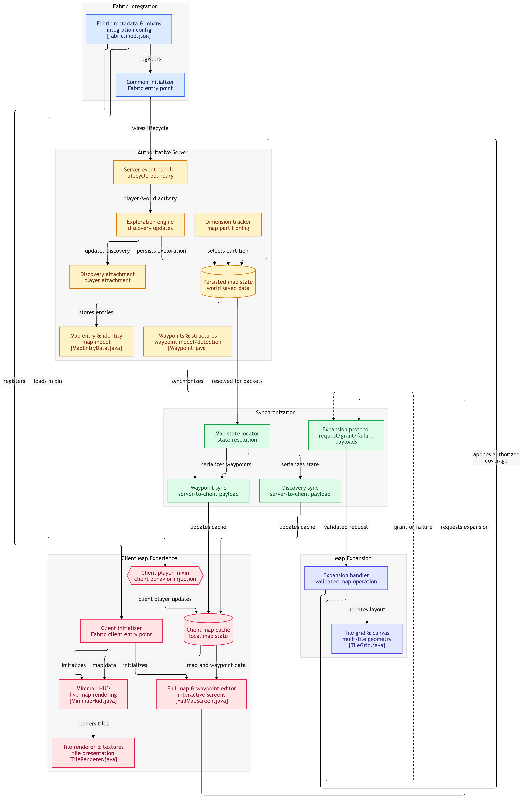
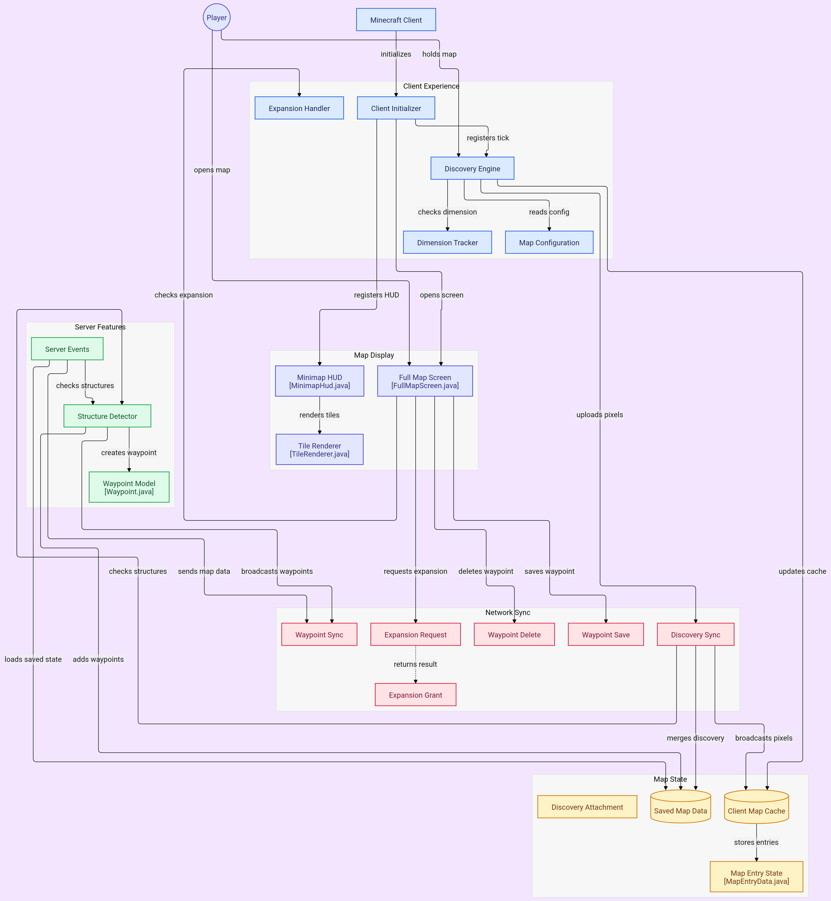

<h1 align="center">Explorers-Dynamic-Offhand-Map</h1>

## **Figure 1 — System Architecture Overview**
> System architecture overview showing Fabric integration, authoritative map state, server–client synchronization, client map experience, and map expansion.

## **Figure 2 — Component and Data Flow**
> Detailed component and data-flow diagram showing client/server interactions, network synchronization, map state, and rendering.

