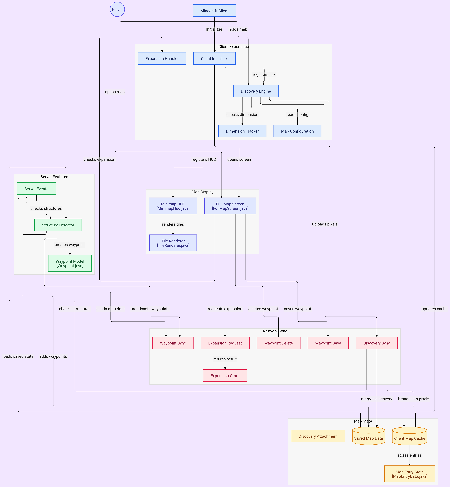

<h1 align="center">Explorer's Dynamic Offhand Map</h1>

This is the Explorer's Dynamic Offhand Map repository, welcome.

Explorer's Dynamic Offhand Map Mod is a [Minecraft](https://minecraft.net/) Java centered around exploring the Minecraft World with an immersive map.
Through the use of a Camera-based Fog-of-Discovery HUD to track only what the player has looked at.
The Explorer's Dynamic Offhand Map Mod is inspired by Minimap Mods  such as [Xaero's Minimap](https://www.curseforge.com/minecraft/mc-mods/xaeros-minimap) and [JourneyMap](https://www.curseforge.com/minecraft/mc-mods/journeymap).

## [**License**](https://github.com/Nokkum/Explorers-Dynamic-Offhand-Map?tab=Apache-2.0-1-ov-file)
The Explorer's Dynamic Offhand Map is Licensed under the [Apache 2.0 License](https://www.apache.org/licenses/LICENSE-2.0)

## **Diagram**

### **Component and Data Flow**

Photo

> Detailed component and data-flow diagram showing client/server interactions, network synchronization, map state, and rendering.
